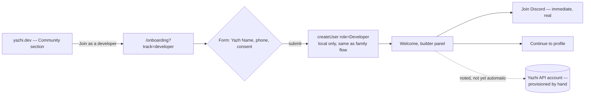
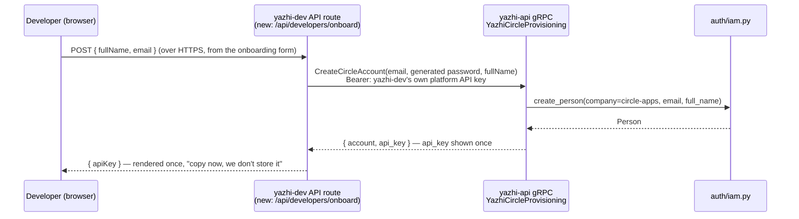

# PRD — Developer Community, Onboarding & Circle Accounts

**Status:** Draft — Phase 0 (manual) shippable now; Phase 1 (self-serve) not started.
**Owner:** Valavan
**Related:** `src/components/sections/Community.tsx`, `src/app/onboarding/page.tsx`,
`yazhi-api/CIRCLE.md`, `yazhi-api/CONTEXT.md`

---

## 1. Problem

Yazhi's actual product surface area right now is Yazh (children, WhatsApp) and
Adhan (an open model). Both depend on a third group that today has no front
door on the site at all: **developers across India who want to build on top
of Adhan or the Yazhi API for their own mother tongue** — the same instinct
that produced Adhan and Open Sangam in the first place, but from people
outside the founding team.

Right now, a developer who lands on yazhi.dev has no path other than
"Join the Network," which is written for and tested against families
signing their child up for Yazh (a `yazhName` + phone number + parental
consent checkbox). There's no track that:

- Frames the pitch in developer terms (open weights, the tokenizer problem,
  the API, not "a voice friend for your child").
- Routes to Discord, where builder conversation actually happens today.
- Gets them a credential to call the Yazhi API.

Separately, `yazhi-api` already has a fully-specified system for exactly the
last piece — **Circle** (`yazhi.circle.v1.YazhiCircleProvisioning`,
documented end-to-end in `yazhi-api/CIRCLE.md`): a third-party app calls
`CreateCircleAccount(email, password, full_name)` with its own API key and
gets back an account + a Circle API key the caller can use against every
other Yazhi service. yazhi-dev would be exactly that third-party app. That
integration does not exist yet.

## 2. Goals

1. Give developers a distinct, honest entry point on the marketing site,
   separate from the family/child onboarding flow.
2. Get every developer who signs up into the Discord immediately — this
   requires no new backend and should ship first.
3. Define the concrete technical path from "developer submits the onboarding
   form" to "developer holds a working Yazhi API key," using the Circle
   system that already exists in `yazhi-api`.
4. Do **not** block (2) on (3). Manual provisioning is an acceptable Phase 0.

## 3. Non-goals

- Building a self-serve API key **dashboard** (rotate/revoke/usage) — that's
  downstream of Circle account creation existing at all, and is its own PRD.
- Changing Yazh's family onboarding flow. The developer track is additive —
  a `?track=developer` branch of the same page, not a rewrite.
- Solving `auth/iam.py`'s in-memory storage problem (`yazhi-api` Phase 1
  follow-up, tracked in `CIRCLE.md` §18). Phase 1 below explicitly assumes
  that migration has *not* happened yet and is written to work anyway.
- Discord server structure/roles/moderation — out of scope for this doc.

## 4. Users

| Persona | Looks like | Wants |
|---|---|---|
| **Hobbyist builder** | Sees Adhan on GitHub or HN, curious about Indic tokenization | Read the code, try the model, ask questions in Discord |
| **Serious integrator** | Edtech/media startup, civic tech team | A working Yazhi API key, rate limits, docs |
| **Contributor** | Wants to add a language, fix the tokenizer, annotate corpus | A way in that isn't "email the founder" |

All three currently get the same experience: none.

## 5. User flow

### Phase 0 — ships with this PR (no backend changes)

- The form itself is unchanged (still just handle + phone + consent — see
  the existing "extend onboarding while launching" note in
  `src/app/onboarding/page.tsx`). Only the copy and the post-submit step
  differ.
- `createUser(..., role: "Developer")` is the same client-side,
  localStorage-backed store the family flow already uses
  (`src/lib/users.ts`). No server round-trip, no new data store — consistent
  with "Phone... stays in your browser — never sent to a server" in the
  existing privacy note.
- The Discord link (`LINKS.discord`) is real and already public
  (`discord.gg/yazhi`). This is the one part of the flow that is fully live
  today.
- The Yazhi API / Circle account is **not** created automatically in this
  phase. The panel says so, honestly, and points at this document.

### Phase 1 — Circle account on submit (proposed, not built)

Key design points, following the contract already in `CIRCLE.md`:

- **yazhi-dev needs its own platform API key** (`*.sovereign` domain, not
  `.admin`) to call `CreateCircleAccount` on a caller's behalf — this is a
  new secret, held server-side only (Next.js API route / server action),
  never in client JS. It is scoped to the `circle-apps` default company
  (`circle_default_company_id`), so no admin elevation is needed for the
  common case.
- **The raw Circle API key is shown exactly once**, in the onboarding
  response, matching `CIRCLE.md` §9 ("Shown once"). The UI must treat this
  like a password reveal: copy-to-clipboard, a "save this now" warning, no
  server-side retention beyond the request/response cycle.
- **Email, not phone, becomes the identifier** for this track — Circle
  accounts are keyed by email (`CIRCLE.md` §6), so the developer form needs
  an email field the family form doesn't have. This is the one form change
  Phase 1 requires.
- **Failure handling**: `ALREADY_EXISTS` (dev already has an account —
  surface "you already have a Yazhi API key, check your email" rather than
  a generic error) and `INTERNAL` (Circle's best-effort-atomic rollback
  already handles a half-created Person — the UI just needs to say "try
  again").
- This is a new gRPC client living in a Next.js server context
  (`endpoints/main.py` in yazhi-api is explicitly "a shim for the WhatsApp
  webhook only" today — it has no REST surface for Circle, so this is new
  wiring on both sides, not a REST call to an existing endpoint).

### Phase 2 — out of scope here

Self-serve key rotation (`RotateAPIKey` is already specified), usage
dashboards, per-developer rate-limit visibility. Revisit once Phase 1 has
real users.

## 6. What ships in this PR

- `src/lib/content.ts` — `DEVELOPERS` content block.
- `src/components/sections/Community.tsx` — a developer-track card,
  visually distinct from the family "Join the Network" card, linking to
  `/onboarding?track=developer` and to Discord directly.
- `src/app/onboarding/page.tsx` — `?track=developer` branch: developer-facing
  copy, and a post-submit "Welcome, builder" panel (Discord CTA now, Circle
  account note for later) instead of the family flow's straight redirect to
  `/profile/edit`.
- This document.

No `yazhi-api` changes ship with this PR — Phase 1 needs its own review
given it introduces a new externally-callable credential path into that
service, and `yazhi-api`'s `CONTEXT.md` is explicit that it should never be
pushed to public GitHub, which constrains where the corresponding client
code can live.

## 7. Success metrics (once Phase 1 lands)

- Developer sign-ups per week vs. Discord joins per week (gap = drop-off
  between "interested" and "joined the room where it's discussed").
- Time from Circle account creation to first authenticated API call
  (`YazhiQuery` etc.) — measures whether the key is actually useful, not
  just issued.
- `ALREADY_EXISTS` rate on `CreateCircleAccount` — a proxy for how often
  people are re-signing-up because they lost their one-time key, which
  would motivate Phase 2's rotation UI sooner.

## 8. Open questions

1. Should the developer track collect anything about *what* they want to
   build (language, use case)? Useful for prioritizing the language roadmap
   (Telugu next, per the deck) but adds friction to a form that's
   deliberately two fields today.
2. Where does the yazhi-dev-side platform API key get provisioned and
   rotated from? `yazhi-api`'s own `scripts/api_keys.py` / `YazhiApiKeys`
   gRPC service can mint it, but someone with admin access has to run that
   once, out of band, before Phase 1 can ship.
3. Does a Circle account get a default domain/role wide enough to be useful
   (`circle_default_domain: sovereign`, `circle_default_role: user` per
   `CIRCLE.md` §12), or do developers need a request-access step for
   specific domains (`legal`, `education`, etc.)? Current defaults suggest
   no extra step needed for a first API call.
